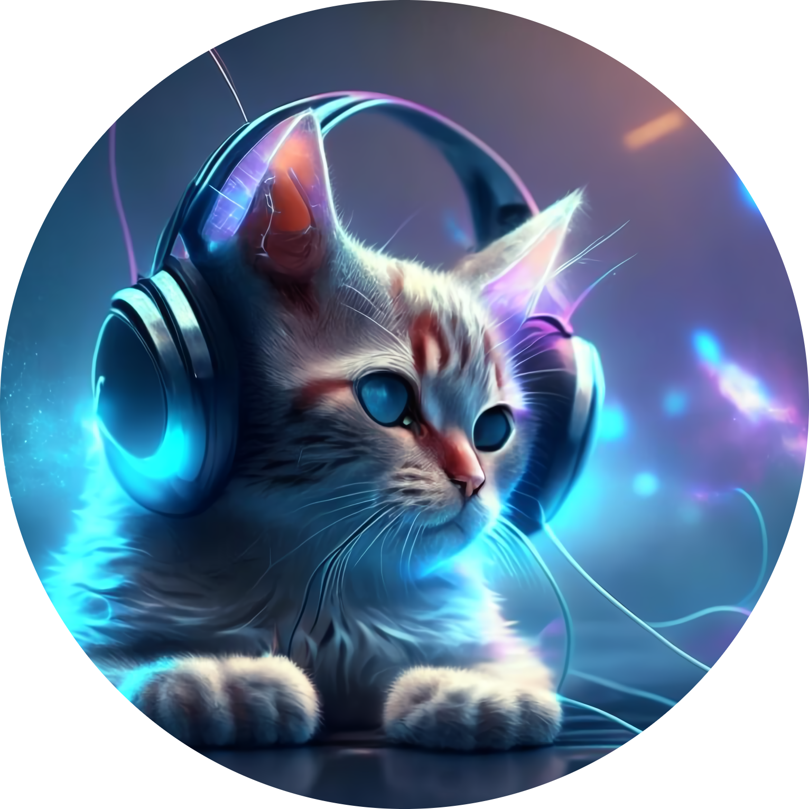

# About Me

  

    
  

  

  <ui>
    <li><code style="color : LightSkyBlue">TeamH4C</code></li>
    <li><code style="color : LightSkyBlue">Reverser & Pwner</code></li>
    <li><code style="color : LightSkyBlue">Vulnerability Analyzer</code></li>
    <li><code style="color : LightSkyBlue">CAU Industrial Security ISANG 2023 Club Leader</code></li>
    <li><code style="color : LightSkyBlue">CAU Industrial Security SECURIOUS Club Web Hacking Track Mentor (2023)</code></li>
    <li><code style="color : LightSkyBlue">KITRI BoB 12th Vulnerability Analysis Track</code></li>
    <li><code style="color : LightSkyBlue">Chung-Ang Univ SECURIOUS Vulnerability Analysis Track Senior (2024.03 ~ )</code></li>
    </ui>
  

 
 

---
### Contact
<code style="color : Cyan"> Discord: neko_hat#1736</code>  
<code style="color : YellowGreen"> Email: dohwan09@cau.ac.kr</code>
---

## Stats
    

---
## Tech
  
  
  
  

---

## Contribute

Open Source Contribute Netatalk (I found discrepancy in buffer size )

---
## Project
* Procagen LIS Development  and Server management (2021.12 ~ 2022.06)
* Fourchains Moulus Service Develop and Server management (2022.06 ~ 2023.07)
* Synology NAS Vulnerability Analysis (Team TGLS, BoB 12th) (2023.09 ~ 2023.12)
* Synology SRM Vulnerability Analysis (PM) (2024.02 ~ 2024.06)
* NVR/IPC Pentest And Vulnerability Analysis (2024.02.16~2024.04.05, in STEALIEN)
* IPC Service Pentest And Vulnerability Analysis (2024.08.12~2024.09.06, in STEALIEN)  

Update Soon...
## CVE

CVE-2024-4464

CVE-2024-53286

CVE-2024-50395

CVE-2024-53287

CVE-2024-53288

CVE-2024-53279

CVE-2024-53280

CVE-2024-53281

CVE-2024-53282

CVE-2024-53283

CVE-2024-53284

CVE-2024-53285

CVE-2024-0854

CVE-2025-44015 

## KVE

KVE-2025-0160

## CTF
* 2022 SSTF 47th (Team ISANG)
* IrisCTF 2023 23rd (Team APT0)
* Dreamhack CTF season3 (div2, 2023.03) 3rd
* 2023 HackTheon Sejong Final Stage (Team NYWT)
* 2023 Christmas CTF (Dreamhack) Contest Challange Submission and Operation.
* 2023, 2024 1st, 2nd Chung-Ang Univ Club Union CTF Contest Challange Submission and Operation.
* 2024 KITRI White Hat School 2nd Class competition CTF Contest Challange Submission and Operation.
* 2024 damCTF 9th (Team budaejjigae)
* 2024 Defcon 26th (Team budaejjigae)
* 2024 Hacktheon Biginner 37th
* 2024 rstcon 2024 10th (Team tw0n3-bytes)
